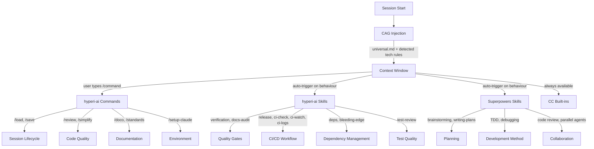

# Skills and Commands Reference

Everything available to an AI coding agent with hyperi-ai attached. Three
layers: our skills, superpowers (marketplace plugin), and Claude Code built-ins.

---

## Layer 1: hyperi-ai Slash Commands

User-invocable commands in `commands/`. Type `/name` to run.

| Command | What It Does | What It Doesn't Do |
|---|---|---|
| `/load` | Reads TODO.md, STATE.md, syncs git, updates submodule. Restores full session context after a restart or new conversation. | Doesn't load standards (CAG injection handles that automatically at session start). |
| `/save` | Checkpoints TODO.md, validates STATE.md (no forbidden content), checks git status, provides session summary. Optionally runs end-of-day housekeeping (doc audit, TODO/FIXME scan, stale branches). | Doesn't commit or push unless explicitly asked. |
| `/review` | Reviews code against corporate standards. Loads all relevant rules for the detected tech stack, audits for violations, and reports findings with file:line references. | Doesn't fix the issues — reports them. Use it to find problems, then fix them yourself. |
| `/simplify` | Reviews recently changed code for unnecessary complexity, duplication, and missed reuse opportunities. Fixes issues it finds. | Doesn't refactor code you haven't touched. Scoped to your changes. |
| `/doco` | Generates full project documentation from code analysis. Produces README sections, architecture diagrams (mermaid), API docs, and infrastructure docs. Outputs to `docs/`. | Doesn't audit existing docs for drift — that's what `docs-audit` (skill) does. |
| `/standards <topic>` | Force-loads a specific standard into context (e.g. `/standards python`, `/standards security`). Useful when auto-detection missed a technology. | Doesn't change which standards apply — just loads them into the current context window. |
| `/setup-claude` | One-time setup wizard. Creates `.tmp/` workspace, surveys installed dev tools (formatters, linters, language runtimes), updates `settings.local.json` with tool-specific permissions. | Doesn't install tools — just configures Claude Code to use what's already installed. |

## Layer 2: hyperi-ai Skills

Skills in `skills/`. Some are user-invocable (`/name`), others auto-trigger
based on what you're doing. Skills contain methodology — they tell the agent
HOW to do something, not just what to check.

### User-Invocable Skills

| Skill | What It Does | What It Doesn't Do | How It Works |
|---|---|---|---|
| `/release` | Full release workflow: `hyperi-ci check` → commit → push → wait for CI → `hyperi-ci release-merge` → PR → merge → monitor → verify artifacts. Optionally follows the release to completion with 2-minute status polls. | Doesn't work without hyperi-ci. Doesn't push directly to `release` branch. Doesn't skip pre-flight checks. | Requires `.hyperi-ci.yaml` and `.releaserc.yaml`. Uses `hyperi-ci release-merge` CLI for the merge PR. Asks before merging and before monitoring. |
| `/deps` | Phase 1: mechanically updates all dependencies, verifies latest versions via web search, runs security audits, resolves Dependabot/Renovate alerts, fixes deprecations, builds and tests. Phase 2 (opt-in): deep upstream health analysis — maintenance trends, abandonment risks, replacement candidates. | Phase 1 doesn't ask permission for each update (it's mechanical). Phase 2 doesn't take action — it produces a report and asks what to do. | Detects ecosystem from manifests (pyproject.toml, Cargo.toml, package.json, go.mod). Web searches every package to verify versions (never trusts training data). |
| `/ci-check` | Runs `hyperi-ci check` locally before pushing. Validates quality + tests match what CI will run. | Doesn't push. Doesn't fix failures — reports them. | Requires hyperi-ci installed. Runs the same checks CI would run. |
| `/ci-watch` | Triggers or monitors a GitHub Actions CI run. Polls for status. | Doesn't fix failures. | Uses `gh run watch` and `gh run view`. |
| `/ci-logs` | Fetches failed CI job logs and presents them for debugging. | Doesn't fix the failures — presents the logs so you can diagnose. | Uses `hyperi-ci logs --failed` or `gh run view --log-failed`. |
| `/test-review` | Audits test suite: coverage gaps, AI-generated test quality, missing edge cases, test structure. Enforces 80% coverage target. | Doesn't write tests — identifies what's missing and where. | Reads test files, compares against source, checks for mocks policy violations. |

### Auto-Trigger Skills

These activate automatically based on what the agent is doing. You don't
invoke them — they fire when their trigger conditions are met.

| Skill | Triggers When | What It Does | What It Doesn't Do |
|---|---|---|---|
| `verification` | About to claim completion, commit, create PR, or express satisfaction ("done!", "fixed!") | Forces the agent to run the actual verification command and read full output before making any claim. No evidence = no claim. | Doesn't decide what to verify — the agent must identify the right command. |
| `docs-audit` | Writing or updating any documentation (README, STATE.md, ARCHITECTURE.md, docs/) | Enforces docs-match-code-reality. Checks file paths exist, APIs match signatures, no hardcoded counts/versions/dates. Mandates mermaid diagrams for architecture. | Doesn't generate docs from scratch — that's `/doco`. |
| `bleeding-edge` | Adding packages, using library APIs, writing Docker FROM lines, any dependency-related code | Forces web search for current versions before using any dependency. AI training data is months stale — this catches it. Uses Context7 MCP for live library docs if available. | Doesn't block you from using bleeding-edge tools — we're fine with that. Just ensures you're using the ACTUAL latest, not a hallucinated version. |

---

## Layer 3: Superpowers (Marketplace Plugin)

From [obra/superpowers](https://github.com/obra/superpowers). Handles
development methodology — how to debug, test, plan, and review. Installed
via `claude plugin install superpowers@superpowers-marketplace`.

| Skill | What It Does | How It Works |
|---|---|---|
| `brainstorming` | Explores user intent, requirements, and design BEFORE implementation. Must be used before any creative work. | Interactive — asks questions, builds understanding, then proposes approach. |
| `writing-plans` | Creates structured implementation plans from specs or requirements. | Produces a plan document with steps, dependencies, and review checkpoints. |
| `executing-plans` | Executes a written plan step-by-step with review checkpoints. | Works through plan items, verifies each before moving to next. |
| `test-driven-development` | RED-GREEN-REFACTOR workflow. Write failing test first, implement, refactor. | Enforces the cycle — won't let you skip the red phase. |
| `systematic-debugging` | 4-phase debugging: reproduce → hypothesise → test → fix. | Prevents guess-and-check. Requires reproduction before any fix attempt. |
| `requesting-code-review` | Prepares work for review — gathers context, diffs, test results. | Structured review request, not ad-hoc. |
| `receiving-code-review` | Handles incoming review feedback with technical rigour. | Prevents blind agreement — verifies feedback is technically correct before implementing. |
| `dispatching-parallel-agents` | Splits independent tasks across multiple subagents. | Identifies which tasks can parallelise, dispatches, coordinates results. |
| `subagent-driven-development` | Executes implementation plans using parallel subagents. | Like executing-plans but with concurrent workers for independent steps. |
| `using-git-worktrees` | Creates isolated git worktrees for feature work. | Smart directory selection, safety verification, cleanup. |
| `finishing-a-development-branch` | Guides completion of dev work — merge, PR, or cleanup. | Presents structured options based on branch state. |
| `writing-skills` | Creates or edits superpowers skills. | Meta-skill for extending the system. |
| `verification-before-completion` | Superpowers' version of verification. | Our `verification` skill is stricter (requires command output evidence). Both can coexist. |

### Conflict Resolution

| Overlap | Resolution |
|---|---|
| Both have verification | Our `verification` is stricter — requires fresh command output. Superpowers version complements it. |
| Both have code review | Superpowers provides methodology, our `/review` adds corporate standards on top. |
| Superpowers uses American English | Our `universal.md` rule overrides — Australian English wins at project level. |

---

## Layer 4: Claude Code Built-ins

These are part of Claude Code itself — always available, no plugins needed.

| Command | What It Does |
|---|---|
| `/help` | Show available commands and help text |
| `/clear` | Clear conversation context |
| `/compact` | Compress conversation to free context window space |
| `/config` | View or change Claude Code settings (theme, model, etc.) |
| `/cost` | Show token usage and cost for current session |
| `/fast` | Toggle fast mode (same model, faster output) |
| `/init` | Create a CLAUDE.md file for the project |
| `/login` | Switch Anthropic account |
| `/logout` | Sign out of current account |
| `/memory` | View or edit CLAUDE.md files |
| `/model` | Switch Claude model |
| `/permissions` | View or modify tool permissions |
| `/status` | Show current session info (model, permissions, context usage) |
| `/vim` | Toggle vim keybindings |

---

## How It All Fits Together

### Precedence

When skills or commands overlap:

1. **User instructions** (CLAUDE.md, direct requests) — always wins
2. **hyperi-ai skills/commands** — corporate standards override methodology
3. **Superpowers skills** — methodology defaults
4. **Claude Code built-ins** — baseline

### What's NOT Covered

These are explicitly delegated to superpowers or not implemented:

- TDD methodology (superpowers)
- Systematic debugging (superpowers)
- Brainstorming/design (superpowers)
- Git worktree management (superpowers)
- Parallel agent coordination (superpowers)
